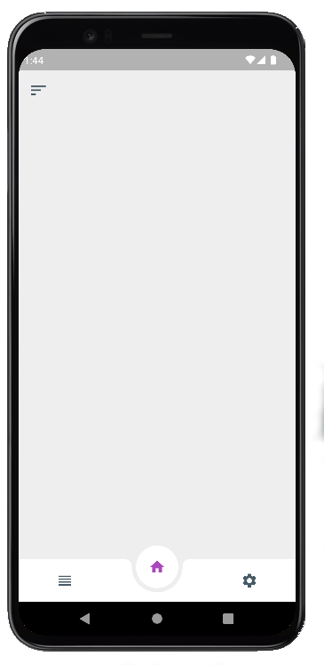
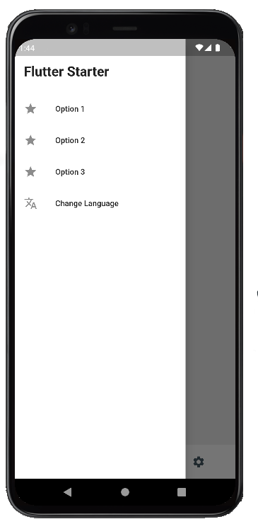
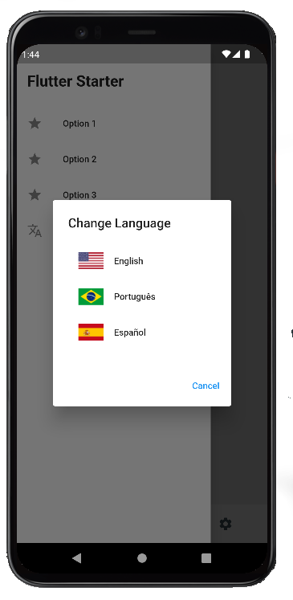

# Flutter App Template

_A ready to use app template, that already comes with the navigation structure, multi-language support, storage and accessibility helpers._

<div style="display: flex; justify-content: center; align-items: center;">
  
  
  
</div>

---
## Whats is included?
This template includes the following features:

- [x] SideBar (Drawer Menu)
- [x] Internationalization
- [x] Custom Mobile icons
- [x] Bottom Nav Menu
- [x] Storage Manager
- [x] Accessibility options

---
## What you need to know

- To configure your app for build, follow [Android Guide](https://docs.flutter.dev/deployment/android) and/or [IOS Guide](https://docs.flutter.dev/deployment/ios).

- To better understand the internationalization and language usage, follow [Easy Localization Guide](https://pub.dev/packages/easy_localization).

- To better understand the Storage Manager, follow the [Hive Guide](https://pub.dev/packages/hive).

- To generate a custom app icon, place your icon on `/assets/icon/icon.png`, and run on at terminal the below command:
```flutter pub run flutter_launcher_icons:main```

## Features

Some of the most important features explained:

### Internationalization
To use a multi-language text, just add a a key/value pair on the language json file, placed at /assets/translations/, and use this key on any part of your app, just with the `.tr()` at the end of the json key. Follow the example:

1. On your translations file, add a key/value pair of some translation, such as this:
```
{
  "my_key": "Corresponding text"
}
```

2. Then, on your app, you can use a `Text()` (or other Widget that accepts strings) with the json key of the desired string, and the `.tr()` ending:
```
Text(
  'my_key'.tr(),
  ...
)
```

### Storage
The storage helper allows you to store and retrieve data, based on a key. Also, you can separate different types of data (keys) in different boxes (similar to tables).
To use this, take a look at the `lib/helpers/storage.dart` file, or follow the example.

1. Save data
```
StorageHelper().saveData(
  'my_key',
  'My data, in primitive type',
  box: 'my_custom_table', // the box is completelly optional. Default is 'storage'
);
```

2. Read data
```
await StorageHelper().getData(
  'my_key', // it will retrieve the data stored within this key
  box: 'my_custom_table', // if the data you want to retrieve was saved on other box than 'storage' (the default). This field is optional.
);
```

## Contributing

The project is looking for and will appreciate any type of contribution! 

_Did you think of a new feature?_ Open an issue!
_Found any documentation that needs grammar correction?_ Open an issue or PR fixing it!
_Have you noticed any improvements that can be applied?_ Tell us! Open an issue or PR fixing it!

### Important considerations
Always try to follow the [Git Flow](https://www.atlassian.com/git/tutorials/comparing-workflows/gitflow-workflow). Based on an issue, create a fork, then a branch, work on it and then, after finishing it, open a Pull Request! **We appreciate a lot the use of [Conventional Commits](https://gist.github.com/qoomon/5dfcdf8eec66a051ecd85625518cfd13)**.

Good Luck!