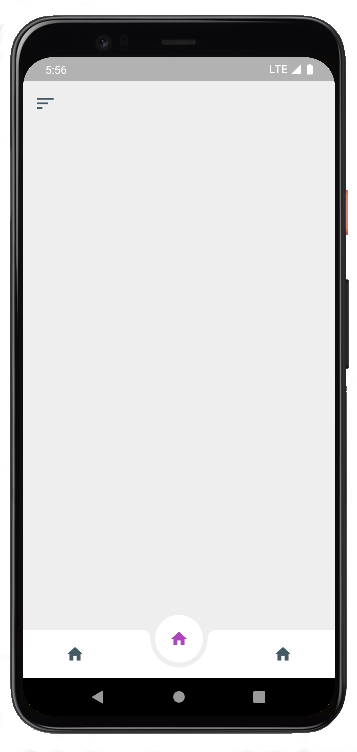
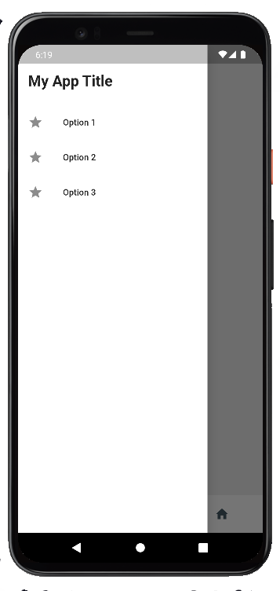

# Flutter App Template

_A ready to use app template, that already comes with the navigation structure, multi-language support and storage helpers (oncoming)._

<div style="display: flex; justify-content: center; align-items: center;">
  
  
</div>

---
## Whats is included?
This template includes the following features:

- [x] SideBar (Drawer Menu)
- [x] Internationalization
- [x] Custom Mobile icons
- [x] Bottom Nav Menu
- [ ] Storage Manager (oncoming)

---
## What you need to know

- To configure your app for build, follow [Android Guide](https://docs.flutter.dev/deployment/android) and/or [IOS Guide](https://docs.flutter.dev/deployment/ios).

- To better understand the internationalization and language usage, follow [Easy Localization Guide](https://pub.dev/packages/easy_localization).

- To better understand the Storage Manager, follow the [Hive Guide](https://pub.dev/packages/hive).

- To generate a custom app icon, place your icon on `/assets/icon/icon.png`, and run on at terminal the below command:
```flutter pub run flutter_launcher_icons:main```

